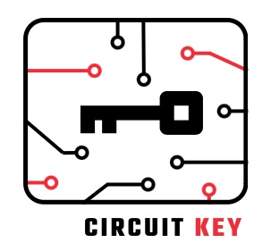

# CircuitKey [Work in Progress Repo]

Simplistic implementation of [FIDO2 protocol](https://fidoalliance.org/specs/fido-v2.0-ps-20190130/fido-client-to-authenticator-protocol-v2.0-ps-20190130.html) written in Python and intended to be used for circuitpython supported devices.

***This project is a POC designed to demonstrate and help individuals (including myself 😃) learn about the inner workings of the FIDO2 protocol in CircuitPython environment. It is not intended for everyday use.*** 

However, there are several projects that specifically aim to develop a device suitable for everyday use. If you are looking for such a device, recommend considering one of these projects.

### What FIDO2 Authenticator is?

It is a hardware device that generates a unique one-time code (OTP) for each login attempt.

The FIDO authenticator works by creating a private and public key pair, where the private key is stored securely on the device, and the public key is registered with the user's online account. When the user tries to log in, the website sends a challenge to the FIDO authenticator device. The device then generates an OTP, signs it with the private key, and sends it back to the website, which verifies the signature using the registered public key.

### Useful links

0. [Passwordless future](https://fidoalliance.org/apple-google-and-microsoft-commit-to-expanded-support-for-fido-standard-to-accelerate-availability-of-passwordless-sign-ins/)
1. [How Fido Works](https://fidoalliance.org/how-fido-works/)
2. [Fido 2.0 Protocol](https://fidoalliance.org/specs/fido-v2.0-ps-20190130/fido-client-to-authenticator-protocol-v2.0-ps-20190130.html)

### Roadmap

1. Improve code quality and fix compatibility issues with CircuitPython.
2. Add support for Elliptic Curve Cryptography (ECC) using mbedtls library - via C python extension (?)
3. Develop an emulator/simulator for testing and debugging.
4. Add Bluetooth support.
5. Migrate to a new repository.
